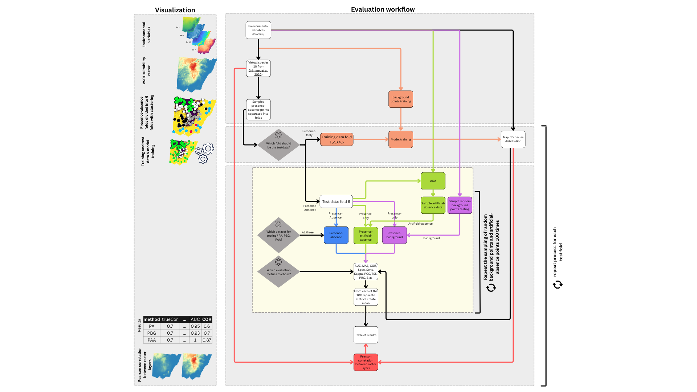
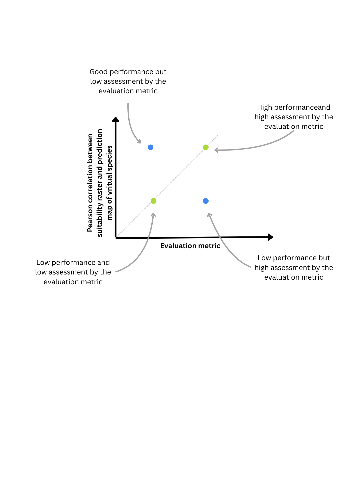
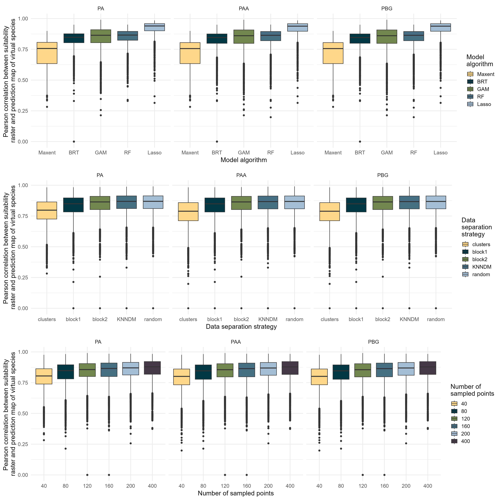
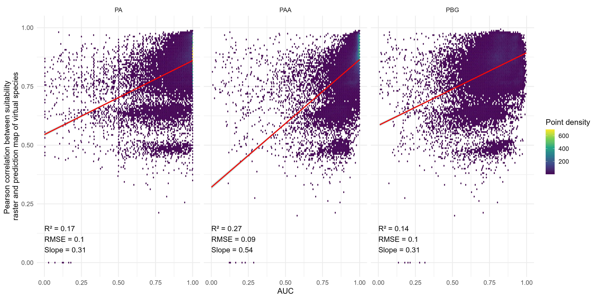
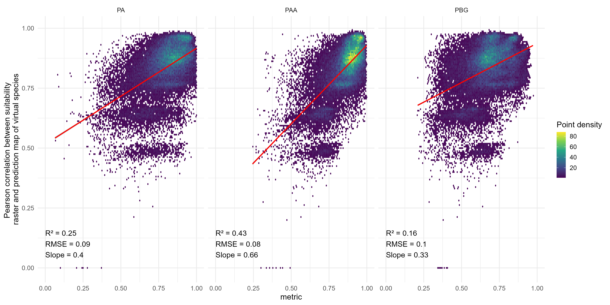
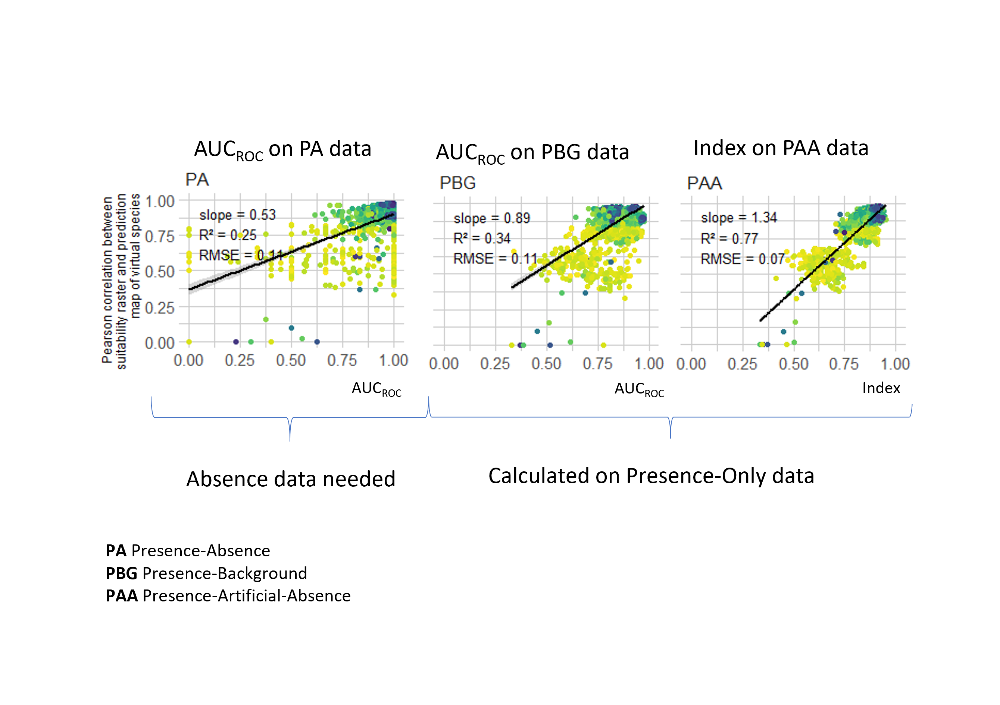

# Evaluation of presence-only species distribution models

### Experimental design
Also available [here](https://www.canva.com/design/DAGsG1V1Q9A/5xo4VLJaQVJNJ0qLQ3rU7g/edit?utm_content=DAGsG1V1Q9A&utm_campaign=designshare&utm_medium=link2&utm_source=sharebutton) for better readability / zooming functionalities.

**Figure X.** *Comprehensive overview of the experimental workflow for simulating and evaluating species distribution models using virtual species.*

### Evaluation workflow
Also available [here](https://www.canva.com/design/DAGvwVhqnH0/g95a-xScVbVwnCuuYYuTTA/edit?utm_content=DAGvwVhqnH0&utm_campaign=designshare&utm_medium=link2&utm_source=sharebutton) for better readability / zooming functionalities.

### Rescaling metrics
Feature scaling (Min-Max-Normalisierung):

- x is an original value
- x' is the normalized value
- min(x) lower bound of target range (for AUC 0.5)
- max(x) upper bound of target range (for AUC 1)

| Metric | Baseline | Min   | Max  | Higher Better? |
|--------|----------|-------|------|----------------|
| AUC    | 0.5      | 0     | 1    | Yes            |
| COR    | -        | -1    | 1    | Yes            |
| Spec   | -        | 0     | 1    | Yes            |
| Sens   | -        | 0     | 1    | Yes            |
| Kappa  | -        | -1    | 1    | Yes            |
| PCC    | -        | 0     | 1    | Yes            |
| TSS    | 0        | -1    | 1    | Yes            |
| PRG    | 0.5      | 0     | 1    | Yes            |
| MAE    | -        | 0     | 1    | No             |
| BIAS   | -        | -1    | 1    | No             |

## Preliminary results

### Differences in model performance: (not relevant for model evaluation metrics but still interesting)
Rank of influence on overall model performance:
1. Model algorithm
2. Data separation
3. Number of sampled PA points

   
**Figure X.** *Presence-absence (PA), Presence-backgorund (PBG), Presence-artificial-absence (PAA)*

### Differences in model performance **metrics**:

1. For all tested metrics (AUC, COR, Spec, Sens, Kappa, PCC, TSS, PRG, MAE, BIAS) evaluation on background points resulted in lower R² than evalaution on PA data. See for example AUC below:

1. for nearly all metrics evalaution on Presence-artificial-absence (PAA) data had a higher R² than on PBG. See below.
        
     **Figure X.** *Presence-absence (PA), Presence-backgorund (PBG), Presence-artificial-absence (PAA)*
1. A combination of some already established evaluation metrics could provide a higher R² than any single metric.
   
**Figure X.** *Presence-absence (PA), Presence-backgorund (PBG), Presence-artificial-absence (PAA)*

### Conclusions:

1. Presence-artificial-absence (PAA) data is better suited to evaluate presence-only SDMs then presence-background (PBG) data.
2. A metric from several already established evaluation metrics gives more insight into actual mode performance than any single metric.
3. Date separation has a hugh influence.

<!--
# DEPRECATED

some further thoughts on this [here](https://docs.google.com/document/d/1w_g_zHOl-no0fK0e-9W92zZXBLmHuiEP_RfSP0wT39E/edit?usp=sharing). 

**Hypothesis 1:**
 The choice of test dataset significantly alters both spatial predictions and performance metrics of species distribution models.

**Hypothesis 2:**
 Commonly used performance metrics do not exhibit a strong correlation with the actual predictive accuracy or ecological relevance of species distribution models.

**Hypothesis 3:**
 Presence-background datasets lead to biased or unreliable evaluation metrics in species distribution modeling.

**Hypothesis 4:**
 A composite evaluation approach that integrates multiple existing metrics provides a more accurate estimate of overall model quality than individual metrics alone.

**Hypothesis 5:**
 Artificial absence sampling from presence-only data improves the reliability of performance metrics compared to standard background sampling methods.

**Phase 1: Species Simulation** involves selecting environmental predictor variables from a predefined bioclimatic set and generating virtual species distributions using the methodology of Grimm et al. (2020). This includes converting continuous habitat suitability predictions into binary presence–absence rasters. A total of 10 virtual species (VS01–VS10) were simulated as distinct ecological niches.

**Phase 2: Sampling** entails sampling presence–absence points at six different effort levels (40, 80, 120, 160, 200, and 400 points). For each virtual species and sampling level, presence and absence points are drawn from the presence–absence raster layer, simulating realistic ecological sampling.

**Phase 3: Preprocessing** consists of separating the sampled presence–absence points into training and test datasets using five different spatial partitioning strategies: random, KNNDM, blockCV1, blockCV2, and clustering. One of the six folds (fold 6) is designated as the test set, and folds 1–5 are used for model training. This phase also distinguishes between presence-only and presence–absence data use cases, affecting the model input structure.

**Phase 4: Model Training** includes fitting five commonly used SDM algorithms: Boosted Regression Trees (BRT), Random Forest (RF), Generalized Additive Models (GAM), Lasso regression, and Maxent. Background points (n = 10,000) are sampled randomly for presence-only models and incorporated with the environmental variables. Each model is trained with the environmental predictors and then evaluated using withheld test data to assess predictive performance.

The **Visualization** column (left) provides examples of key raster and spatial data products generated during the workflow, including environmental variables, habitat suitability layers, sampled training/testing points, and final species distribution predictions.

The **Experiments** column (right) quantifies the factorial design across all tested parameters: 10 virtual species × 6 sample sizes × 5 data partitioning strategies × 5 model algorithms × 5 replicates, resulting in a total of **45,000 independent model runs**. Each modeling run represents a unique combination of ecological realism, sampling design, spatial structure, and algorithmic choice. This full factorial experimental design allows for systematic assessment of the effects of each factor and their interactions on SDM performance and stability.

Arrows and dashed boxes indicate the logical flow of information and parameter control across workflow phases. The design aims to mimic real-world species distribution modeling pipelines while allowing controlled manipulation of ecological, statistical, and computational assumptions.

### Evaluation of the experiments

### Methods
The models are calculated on 10 virtual species. Virtual species from [Grimmet et al. 2021](https://doi.org/10.1016/j.ecolmodel.2020.109194).

## Deprecated: 

deprecated:
In this study we show:
1. that the exact same map of species distribution can mirror “unusable” or “near perfect” performance metrics based on the decision the modeler makes.
2. that a metric calculated on several already established performance metrics can provide a more robust estimate of model performance.
3. that this metric can be calculated on presence-only data by sampling artificial absence data.

### Preliminary results
All metrics are campared against a pearson correlation (y-axis) between the map/raster of the modeled prediction and the suitability raster calculated with `terra::layerCOR()`.
 
Image on the left: Shows AUC calculate on Presence-Absence data.

Image in the middle: Shows AUC calculated on Presence-Only and background data. This is the combination that is probably most often used in reality. 

Image on the right: Shows a metric (not the AUC!) calculated from severals performance metrics to average out the uncertainities of single metrics. Presnece-Only data are used togehter with artificial absence data.

-->
