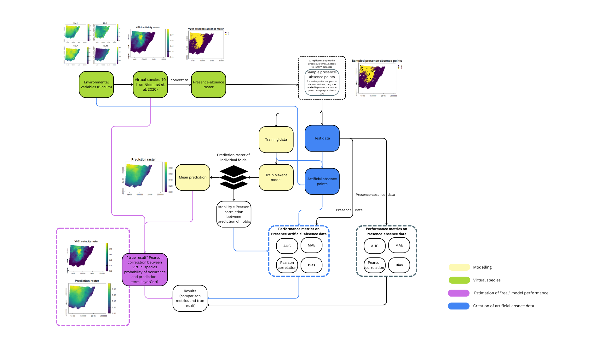
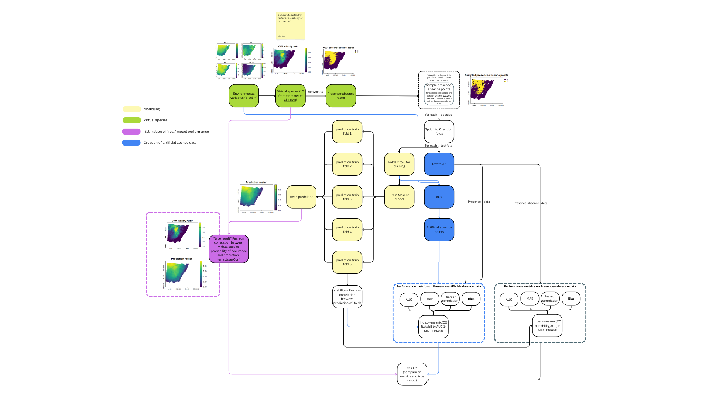

# Evaluation of presence-only species distirbution models

Calculated on 10 virtual species. Virtual species from [Grimmet et al. 2021](https://doi.org/10.1016/j.ecolmodel.2020.109194).

### Simplified workflow
Also available [here](https://www.canva.com/design/DAGoQsREV4I/LJuZQiilc2LV3LAUtLvcKA/edit?utm_content=DAGoQsREV4I&utm_campaign=designshare&utm_medium=link2&utm_source=sharebutton) for better readability / zooming functionalities.

### Full Workflow
Also available [here](https://www.canva.com/design/DAGoQAAKF8E/IAn1Zi1qZIhZnv67fm0TrA/edit?utm_content=DAGoQAAKF8E&utm_campaign=designshare&utm_medium=link2&utm_source=sharebutton) for better readability / zooming functionalities.

### Preliminary results

