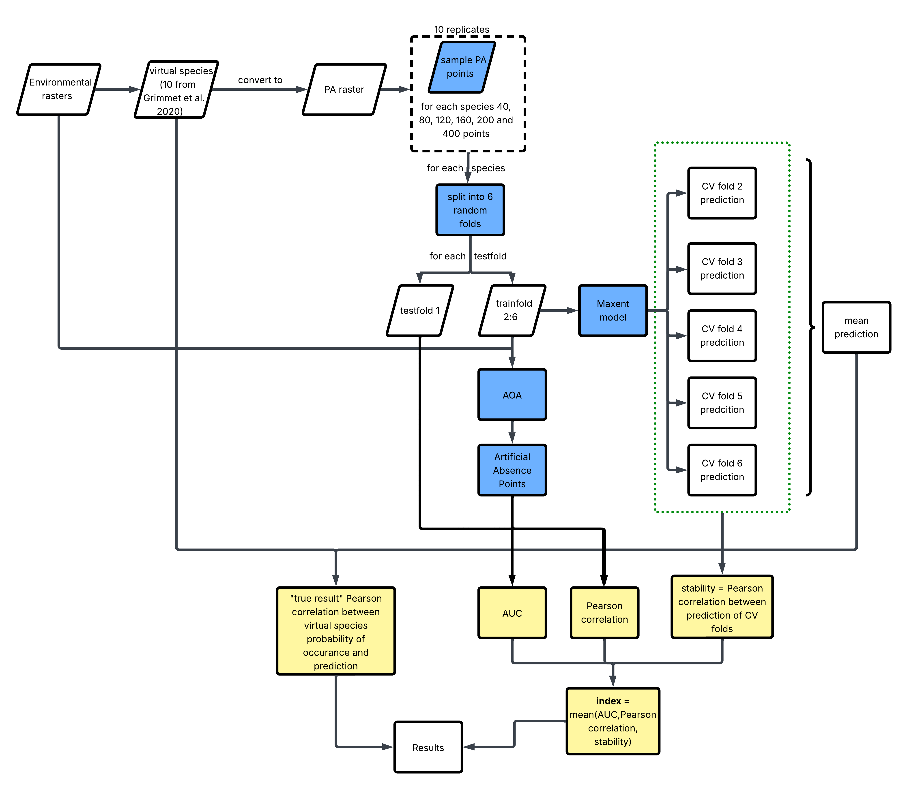

# Evaluation of presence-only species distirbution models

Calculated on 10 virtual species. Virtual species from [Grimmet et al. 2021](https://doi.org/10.1016/j.ecolmodel.2020.109194).

### Workflow

### Preliminary results

