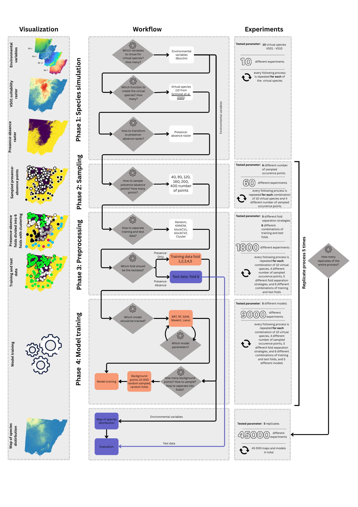

# Evaluation of presence-only species distribution models

some further thoughts on this [here](https://docs.google.com/document/d/1w_g_zHOl-no0fK0e-9W92zZXBLmHuiEP_RfSP0wT39E/edit?usp=sharing). 

In this study we show:
1. that the exact same map of species distribution can mirror “unusable” or “near perfect” performance metrics based on the decision the modeler makes.
2. that a metric calculated on several already established performance metrics can provide a more robust estimate of model performance.
3. that this metric can be calculated on presence-only data by sampling artificial absence data.

The models are calculated on 10 virtual species. Virtual species from [Grimmet et al. 2021](https://doi.org/10.1016/j.ecolmodel.2020.109194).

### Simplified workflow
Also available [here](https://www.canva.com/design/DAGoQsREV4I/LJuZQiilc2LV3LAUtLvcKA/edit?utm_content=DAGoQsREV4I&utm_campaign=designshare&utm_medium=link2&utm_source=sharebutton) for better readability / zooming functionalities.

### Full Workflow
Also available [here](https://www.canva.com/design/DAGoQAAKF8E/IAn1Zi1qZIhZnv67fm0TrA/edit?utm_content=DAGoQAAKF8E&utm_campaign=designshare&utm_medium=link2&utm_source=sharebutton) for better readability / zooming functionalities.

### Preliminary results
All metrics are campared against a pearson correlation (y-axis) between the map/raster of the modeled prediction and the suitability raster calculated with `terra::layerCOR()`.
 
Image on the left: Shows AUC calculate on Presence-Absence data.

Image in the middle: Shows AUC calculated on Presence-Only and background data. This is the combination that is probably most often used in reality. 

Image on the right: Shows a metric (not the AUC!) calculated from severals performance metrics to average out the uncertainities of single metrics. Presnece-Only data are used togehter with artificial absence data.

